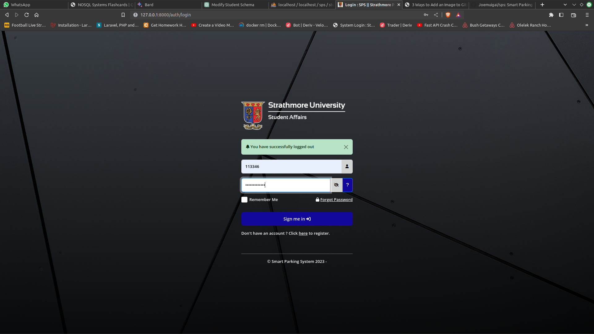

## Smart Parking System - Using Automated Number Plate Recognition (ANPR)

This project aims to develop an automated smart parking system for an organization, providing a streamlined parking experience for its members. Upon arrival, a camera-based automatic number plate tracking system, utilizing object detection and character recognition, will verify vehicle registrations from a centralized database. Integrated with the organization's entrance security, the system will grant authorized vehicles access and allocate parking space, enhancing overall security measures. Through efficient monitoring and real-time tracking, the system will effectively manage parking spot availability.

### Installation Instructions - [Local Deployment]

To install, open command prompt and type:

```bash
$ cd C://xampp/htdocs/
$ git clone https://github.com/Joemuigai/sps.git
$ cd sps
$ composer update
$ copy .env.example .env
$ php artisan key:generate
$ php artisan migrate
$ php artisan db:seed
$ php artisan storage:link
$ php artisan queue:work
$ php artisan serve
```

### Screenshots

1. Login Page



### Security Vulnerabilities

If you discover a security vulnerability within this application, please send an e-mail to Joe Muigai via [joemuigai004@gmail.com](mailto:joemuigai004@gmail.com). All security vulnerabilities will be promptly addressed.

### License

The SPS project is open-sourced software licensed under the [Apache license](http://www.apache.org/licenses/).
